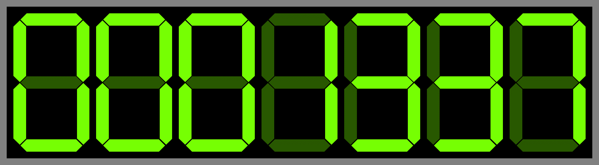

# click7 - Retro 7-Segment Website Counter!
[](https://github.com/lquenti/click7/actions/workflows/rust.yml)

A very simple web server to track your visitors like its 1999



## Features
- Single Binary, Zero Dependencies
- Zero configuration (besides where to save the database file)
- Works out of the box

## Installation
For now, just build it yourself. Install [rust](https://rustup.rs/) (no root required) if you haven't and then run

```
cargo install click7
```

After that, it should be available as `click7`

## How it works
When you embed an image into the HTML, the image server gets a request when its loaded. Thus, you can track different pages by loading different images.

click7 accepts anything under `/generate/SOMETHING` as an image, so just choose a different `SOMETHING` for each page you want to track and embed the image.

## How to set up

See `click7 --help for all options`

```
> click7 --help
website click counter with 7 segment display

Usage: click7 [OPTIONS] --database <DATABASE>

Options:
      --database <DATABASE>  The path to the database (should end with .redb)
  -d, --digits <DIGITS>      The amount of digits printed (i.e. 7 digits => 0-9999999) [default: 7]
  -p, --padding <PADDING>    The padding around each of the digits in pixels [default: 20]
  -b, --border <BORDER>      The thickness of the grey border [default: 20]
      --port <PORT>          port [default: 3000]
  -h, --help                 Print help
  -V, --version              Print version
```

Thus, to run it with the defaults, just start it with

```
click7 --database ./mydb.redb
```
After that, it should be available at <http://localhost:3000>.

All routes are created dynamically based on the image path you provide. Lets say you have some pages, you can for example choose `my_website_page_a` and `my_website_page_b` as the keys/image names and embed 
```
<!-- On the first page -->


<!-- On the second page -->

```

If you need SSL/HTTPS, you have to reverse proxy it, I can recommend something like [traefik](https://traefik.io/traefik/), although friends also often tell me how great [caddy](https://caddyserver.com/) is.

## All Routes
```
/ -> basic description of the server
/health_check -> HTTP 200 if the server is alive
/generate/<N> -> generates N as a number
/cnt/<ID> -> tracks how often that <ID> subpath was accessed
```

## License
MIT 2024 Lars Quentin
